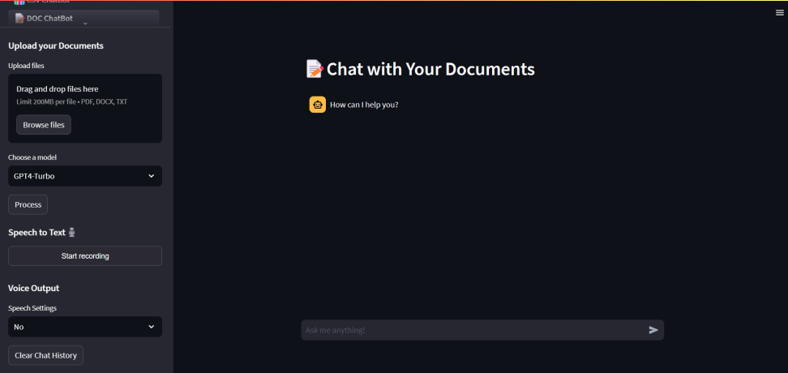
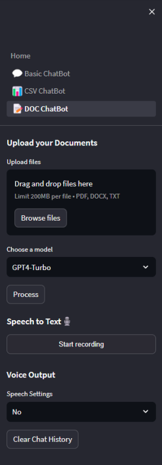
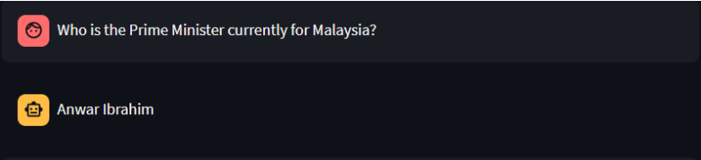
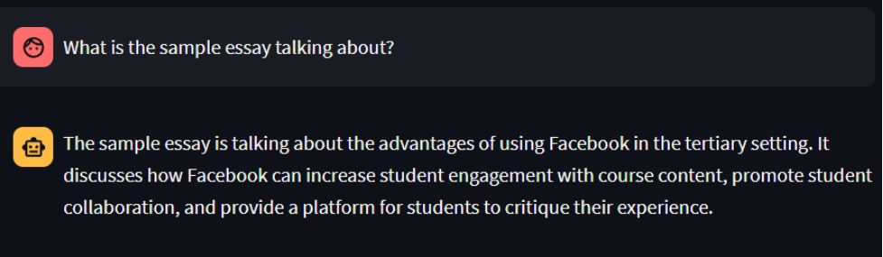

# docBot: AI-Powered Document Processing Chatbot 📄🤖
docBot is a cutting-edge Natural Language Processing (NLP) chatbot designed to extract, analyze, and interpret information from various document formats (PDF, DOCX, TXT). 
Leveraging Large Language Models (LLMs) like GPT-3.5 Turbo, Llama2, and Gemini-Pro, the chatbot aims to provide accurate, fast, and context-aware responses for document-based queries.

### Key Features
📄 Multi-Format Document Processing: Supports PDF, DOCX, and TXT file analysis. 
🔍 Intelligent Information Extraction: Retrieves key insights, summaries, and answers from documents. 
💡 Context-Aware Responses: Utilizes LLMs (GPT-3.5 Turbo, Llama2, Gemini-Pro) to generate accurate and natural replies. 
⚡ Fast & Scalable: Built with LangChain, Vector Databases, and Streamlit for real-time performance. 
📊 Evaluation Metrics: Assesses chatbot responses based on accuracy, speed, readability, and creativity.

### Technology Stack
Backend: LangChain, OpenAI GPT-3.5 Turbo, Llama2, Gemini-Pro 
Frontend: Streamlit (for UI interaction) 
Database: Vector Database for efficient text retrieval 
Cloud Services: OpenAI API for LLM integration

### System Workflow
1.User Uploads a Document → Supports PDF, DOCX, TXT 
2.Text Extraction → Extracts content and prepares it for processing 
3.Text Chunking & Embedding → Splits document content and converts text into vectorized embeddings 
4.Vector Database Storage → ChromaDB stores processed text for fast retrieval 
5.User Queries the Chatbot → User asks questions related to the document 
6.LLM Processing → Gemini-Pro generates context-aware responses 
7.Response Display → Chatbot presents an intelligent answer based on document content

### Limitations
Model Dependency: The chatbot's effectiveness depends on the training data of the LLM. 
Internet Connection: Requires a stable internet connection for optimal performance. 
Limited Knowledge Updates: Periodic updates are needed to improve document comprehension.

### Future Enhancements
Support for more document formats (Excel, JSON, Markdown). 
Integration with database storage for persistent document retrieval. 
Improved multi-document handling for better context awareness. 
Fine-tuning on domain-specific datasets for improved accuracy.

### Sample Screenshot
> Interface design for the chatbot system
  
> Sidebar design for the chatbot system that able to let users upload their files and choose their favourite model
  
> Sample Q&A with the chatbot
  
> Sample Q&A with the chatbot
  
> Sample Q&A with the chatbot
  
